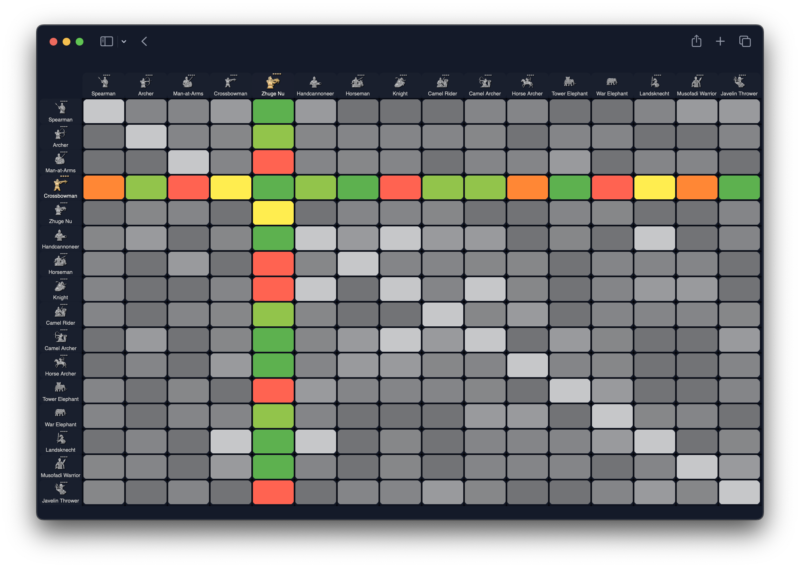

# Age of Empires IV counter chart

This is an interactive table of the counters for units within the game.

 
 

    

 <a href="https://leandrosq.github.io/aoe4-counter-chart/">
   Live demo here
 </a>

## Project

| Name | Description |
| --- | --- |
| BeastyqtSC2 | [ULTIMATE AGE OF EMPIRES 4 UNITS GUID](https://www.youtube.com/watch?v=DQXKRRELcek&ab_channel=BeastyqtSC2) video, which provided the data. |
| aoe4world | [Data github repository](https://github.com/aoe4world/data) for compiling the .json files and providing the images. |
| Jimp | [Image manipulation library](https://www.npmjs.com/package/jimp) used to generate the images. |
| EJS | [Template engine](https://ejs.co/) used to generate the HTML. |

## How it works

Basing on BeastyqtSC2's chart, it samples the .png file and generates a grid with the data.
Using this data, it fetches information from the aoe4world's data repository and generates a .json file with the data.
Finally, it uses EJS to generate the HTML file.